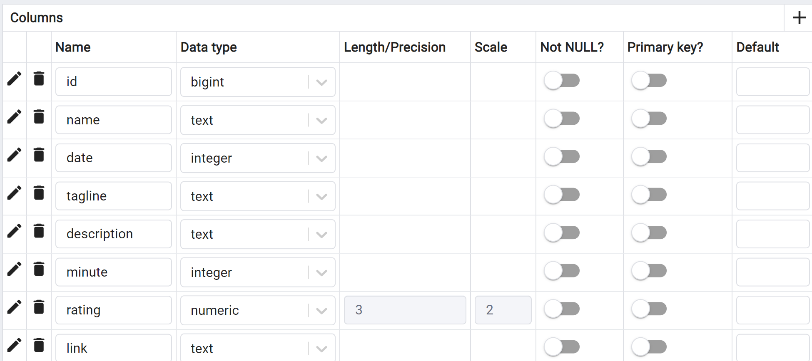

# TWEB_Project

## Instructions for running the project  

### In IntelliJ:  
#### SDK
Navigate to File/Project Structure/Project/    
- Set the SDK to SDK22 (Oracle OpenJDK 22.0.1)  
#### Gradle
1. **File > Project Structure > Modules**.  
**Add a Gradle module:**  
  * Click on the ‘+’ button in the top left-hand corner.  
  * Select **Import Module**.  
  * Navigate to the file : solution/SpringBootServer/build.gradle  
2. View > Tool Windows > Gradle and click on **Reload All Gradle Projects**.  

### Install Node.js Dependencies
In the terminal, go to the solution/MongoDBServer folder and enter the commands:  
- npm install  
- npm uninstall mongoose  
- npm install mongoose@latest

### Run the Servers
At the top, to the left of the ‘Run’ button, choose CurrentFile then run the files:  
- solution/MainServer/bin/www.js  
- solution/MongoDBServer/bin/www.js  
- solution/SpringBootServer/src/main/java/it/unito/iumtweb/springboot/FirstExampleApplication.java

Finally, access the site in Google Chrome at the URL: http://localhost:3000/  

## WARNING: IT'S NOT OVER YET

**For Rotten Tomatoes reviews:**
- Send a message from any chat on the site
- Now you can go into mongoDBCompass
- Go to the chatmessages collection in chatDB.
- Add the file final_reviews.csv from this link: https://drive.google.com/file/d/1X1o7cpBlaoZby3kOAqMp8-eWwNEoZYok/view?usp=sharing
- Change the type:
  - room(Int32): change to String
  - message(Mixed): change to String
- Click on Import

*In additionalNoteBook/MongoDB I've put the notebook I used to modify the Rotten Tomatoes reviews to adapt them to our site.*

**To have the details of each movie when you click on it you must :**
- Go to pgAdmin4
- Create a new table: details_movie
- Go to the columns tab and enter the columns below:

- Then right-click on the details_movie table > Import/Export data
- Insert the .csv file from this link: https://drive.google.com/file/d/1gqXiQM4zEp458HyhvLPq_4x4oyQgvlUI/view?usp=sharing
- Click on OK

I've also included the notebook with which I've synchronised all the film information in additionalNoteBook/PSQL/Notebook.

## You now have all the information you need to make full use of our website.